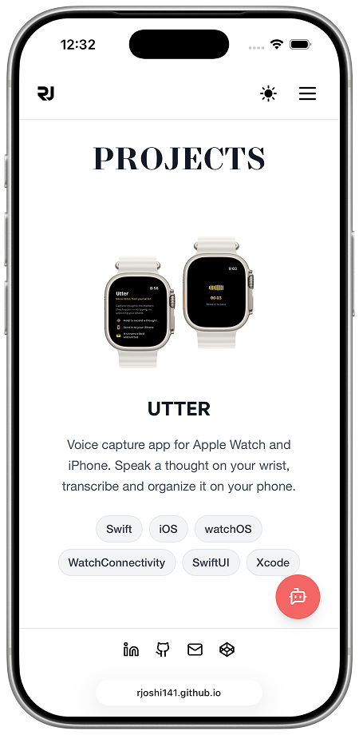
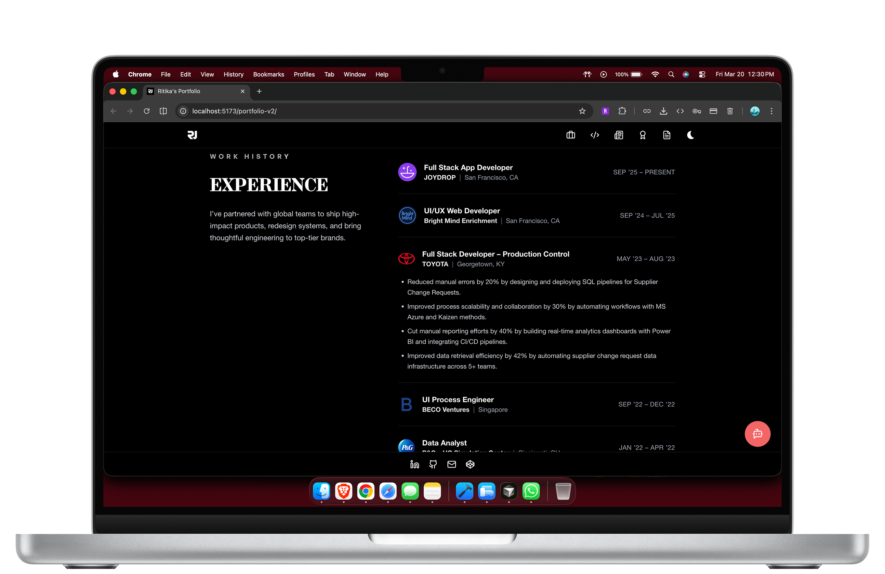
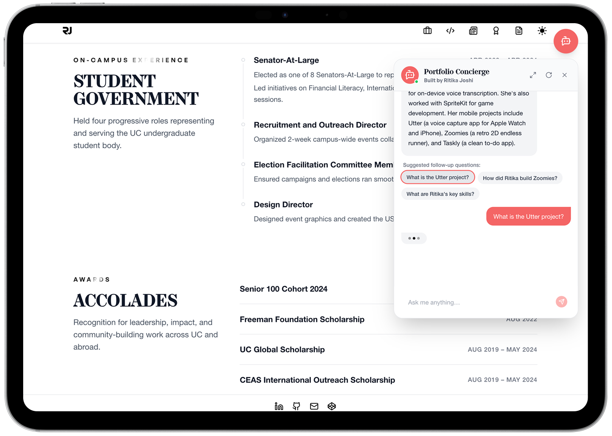

<div align="center">
  
  <h2>Ritika's Portfolio</h2>
    <p>A personal portfolio built with React — fast, interactive, and designed with care.</p>

</div>


## Screens

<div align="center">
  
  &nbsp;&nbsp;
   
    &nbsp;&nbsp;
    <br></br>
  
 
 
</div>


## What This Is

This repository contains the full source code for a personal portfolio site. It's a React application built to be fast, polished, and interactive — showcasing work experience, projects, writing, and leadership background. The portfolio includes several custom-built interactive features rather than relying on templates or component libraries for layout.

## Sections


| Section        | Description                                                              |
| -------------- | ------------------------------------------------------------------------ |
| **Home**       | Intro with physics-based 3D lanyard card and scrolling tech stack ticker |
| **Experience** | Accordion-style work history across 6 companies                          |
| **Projects**   | Image-forward project showcase with load-more                            |
| **Articles**   | 3D book-flip page-turn animation for browsing writing                    |
| **Leadership** | Vertical timeline of campus roles and awards accordion                   |


## Notable Features

**AI Portfolio Concierge** — a chatbot widget built with a local knowledge base (`src/utils/ritikaBrain.js`). All answers are computed in-browser via pattern matching against `src/utils/ritikaKnowledgeBase.js` — no external API calls. The widget is draggable and snaps to any corner of the viewport on release.

**3D Lanyard** — a physics-simulated hanging ID card on the home page, built with Three.js and React Three Fiber. The card swings and responds to cursor movement.

**Book-flip Articles** — the articles section uses raw CSS 3D transforms (`rotateY`) with pointer-event-based drag tracking to simulate realistic page-turning, pivoting from the correct edge depending on direction.

**Light / Dark Mode** — system-aware with a manual toggle in the navbar. All sections and components adapt fully.

## Tech Stack


| Layer      | Tech                                        |
| ---------- | ------------------------------------------- |
| Framework  | React 18 + Vite                             |
| Styling    | Tailwind CSS                                |
| Animation  | Framer Motion, GSAP                         |
| 3D         | Three.js, React Three Fiber, Rapier physics |
| Deployment | GitHub Pages                                |


## Getting Started

```bash
# Install dependencies
npm install

# Start dev server
npm run dev

# Production build
npm run build
```

## Repo Structure

```
src/
├── components/        # Reusable UI — Navbar, Lanyard, ChatbotWidget, ScrollFloat, etc.
├── pages/             # Section-level components — Home, Experience, Projects, Articles, Leadership
├── utils/
│   ├── ritikaBrain.js             # Pattern matching logic for the chatbot
│   └── ritikaKnowledgeBase.js     # All Q&A entries the chatbot can answer
├── assets/            # Logos, project frame images, icons
public/
├── logo.png
├── iPhone.png
├── ipad.png
└── macbook-pro.png
```

## Updating the Chatbot

The chatbot's knowledge lives entirely in `src/utils/ritikaKnowledgeBase.js`. Each entry has a category, tags, question patterns, and a structured answer. To add or update what the bot knows, edit or add entries in that file — no backend or API changes needed.